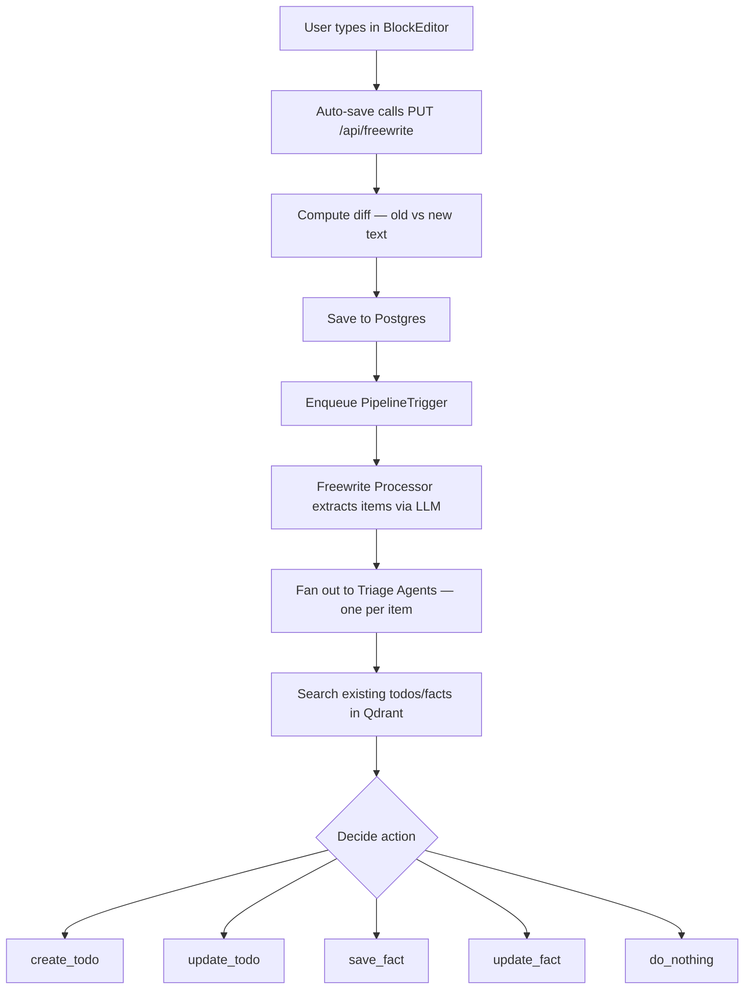
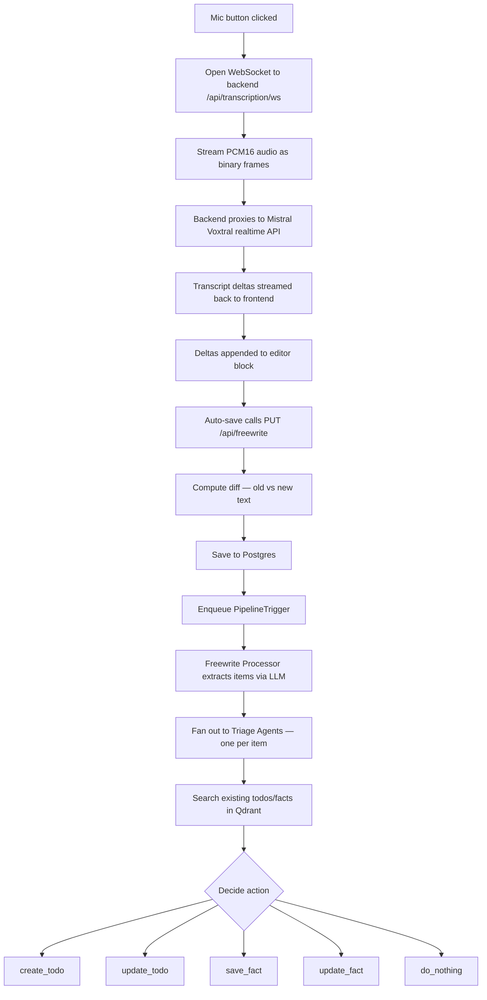
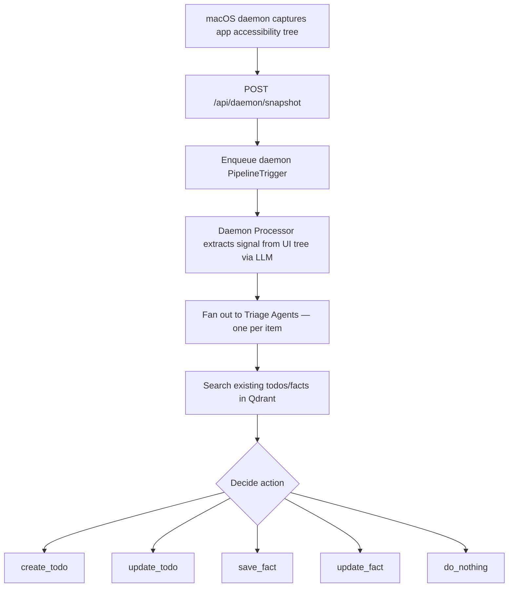

# Flex Architecture

Flex is a continuous signal processing pipeline that ingests input from users and their devices, extracts actionable items, and triages them using LLM agents. Input sources include a freewrite editor (typed or dictated text), voice transcription, and a macOS daemon that captures ambient context from running apps.

**Stack**: Next.js frontend + FastAPI backend + LangChain agents + Qdrant (vector search) + PostgreSQL

---

## Infrastructure

Two Docker services (`backend/docker-compose.yml`):

| Service    | Image               | Port         | Purpose                    |
| ---------- | ------------------- | ------------ | -------------------------- |
| `qdrant`   | qdrant/qdrant:v1.16 | 6333 / 6334  | Vector DB for todos/facts  |
| `postgres` | postgres:17         | 5433 -> 5432 | Users + freewrite docs     |

Data persists to `storage/` (gitignored).

---

## Backend

### Entry Point (`main.py`)

FastAPI app with async lifespan: initializes Tortoise ORM + Qdrant collections on startup. Registers six routers (auth, daemon, freewrite, todos, facts, transcription) and CORS middleware.

### Authentication (`auth.py`)

HTTP Basic auth. `verify_user()` dependency looks up username in Postgres and verifies with bcrypt. All routers are protected.

### Shared Types (`models.py`)

- **`TodoItem`** -- id, title, description, parent_id, status (pending/in_progress/completed/cancelled), timestamps
- **`FactItem`** -- id, fact, category (preference/personal/work/context/other), tags, created_at
- **`TriagePayload`** -- text + context, passed from freewrite processor to triage agent

### Database Models (`db_models.py`)

- **`User`** -- username, password_hash (Postgres)
- **`FreewriteDocument`** -- JSON content, one per user (Postgres)

Todos and facts live in Qdrant, not Postgres.

### API Routers

| Endpoint                     | Method | Description                                       |
| ---------------------------- | ------ | ------------------------------------------------- |
| `/api/auth/check`            | GET    | Validate auth token                               |
| `/api/freewrite`             | GET    | Load freewrite content                            |
| `/api/freewrite`             | PUT    | Save content, compute diff, trigger AI pipeline   |
| `/api/todos`                 | GET    | List all todos                                    |
| `/api/todos/{id}`            | GET    | Get a todo                                        |
| `/api/todos`                 | POST   | Create a todo                                     |
| `/api/todos/{id}`            | PATCH  | Update a todo                                     |
| `/api/todos/{id}`            | DELETE | Delete a todo                                     |
| `/api/facts`                 | GET    | List all facts (read-only, created by AI)         |
| `/api/transcription/ws`      | WS     | Authenticated WebSocket proxy for Mistral voice transcription |
| `/api/daemon/snapshot`       | POST   | Receive daemon accessibility tree snapshot        |

### AI Agent Pipeline (`ai/`)

Two input paths feed into a shared triage stage:

**Path A: Freewrite Processor** (`ai/agents/freewrite_processor_agent.py`)
- Takes trigger text (newly typed text) + document context
- Uses LLM structured output to extract actionable items as `TriagePayload` objects
- Identifies subjects — when trigger mentions multiple subjects, extracts separate items for each
- Filters noise (greetings, gibberish, single characters)
- Fans out to triage agents via `asyncio.gather()`

**Path B: Daemon Processor** (`ai/agents/daemon_processor_agent.py`)
- Takes accessibility tree snapshots from the macOS daemon (app name, category, content)
- Extracts signal from UI tree: action items, decisions, status updates, commitments
- Filters UI chrome (buttons, links, timestamps, generic layout text)
- Groups by subject and fans out to the same triage agents

**Triage Agent** (`ai/agents/triage_agent.py`)
- Processes one extracted item at a time via a tool-calling loop (max 5 iterations)
- Has seven tools: `search_todos`, `search_facts`, `create_todo`, `update_todo`, `save_fact`, `update_fact`, `do_nothing`
- Always searches before acting to avoid duplicates
- Status-only changes (complete, cancel, etc.) update only `status` and `tags` — never touch `title` or `description`
- Decides: status change, new todo, update existing todo, save new fact, update existing fact, or do nothing

**Queue Manager** (`ai/queue_manager.py`)
- Singleton async queue ensuring pipeline triggers are processed serially
- Supports two trigger types: `freewrite` (from editor saves) and `daemon` (from app snapshots)
- Prevents race conditions from rapid successive saves

**LLM Config** (`ai/config.py`)
- All LLM and embedding calls routed through OpenRouter
- Default model: `openai/gpt-5-mini`, temperature 0.1
- Configurable provider switching via `PROVIDER` env var (e.g. `cerebras` routes to `openai/gpt-oss-120b` with provider pinning)

### Storage Layer (`store/`)

| Data       | Store    | Why                                                   |
| ---------- | -------- | ----------------------------------------------------- |
| Users      | Postgres | Relational, auth queries                              |
| Freewrite  | Postgres | JSON column, one per user, no search needed           |
| Todos      | Qdrant   | Semantic search for triage agent to find related todos |
| Facts      | Qdrant   | Semantic search for triage agent to find relevant knowledge |

Both Qdrant collections use **multivector** config (MaxSim comparator) — each document has multiple embedding vectors (from tags). Search is **hybrid**: vector similarity + keyword full-text, merged and deduped.

---

## Frontend

### Stack

Next.js 16, React 19, BlockNote editor, Tailwind CSS v4, SWR, Axios, Radix UI / Shadcn components.

### Layout (`components/editor/DocumentFeed.tsx`)

Two-panel split:
- **Left**: BlockNote editor + voice input button
- **Right**: Fixed 500px tabbed sidebar with Todos and Facts lists

Todos render as expandable cards with nested children (via `parent_id`), color-coded status badges, and sorted by most recent update. Facts render as expandable cards with category badges (color-coded by type) and tag pills.

### Block Editor (`components/editor/BlockEditor.tsx`)

Minimal BlockNote editor (no menus, no toolbar — just text input). Smart auto-save: immediate on sentence-ending punctuation or newline, 1-second debounce otherwise.

### Voice Input (`hooks/useRealtimeTranscription.ts`)

1. Frontend opens WebSocket to backend (`/api/transcription/ws?token=...`), authenticated via Basic auth token
2. Backend proxies audio to Mistral's Voxtral realtime transcription API (`voxtral-mini-transcribe-realtime-2602`) using the `mistralai` SDK
3. Mic audio captured at 16kHz via ScriptProcessor, converted to PCM16, sent as binary frames
4. Client-side VAD (RMS-based) detects speech activity for UI feedback
5. Mistral streams transcript deltas back through the backend WebSocket to the frontend
6. Deltas appended to a dedicated editor block, triggering the save → AI pipeline flow

Voice button shows multi-state feedback via `MicState` enum: amber pulse while connecting, green pulse while speaking, amber pulse while listening.

### Auth (`components/AuthGate.tsx`)

Login form → Base64-encodes credentials → stores in sessionStorage → Axios interceptor attaches `Authorization: Basic` header on every request. User menu (bottom-right) shows username initial and provides logout.

### Data Fetching

SWR with 500ms polling for todos and facts. Freewrite content loaded on mount.

---

## Data Flow

### Text → Todos/Facts

### Voice → Text → Todos/Facts

### Daemon Snapshot → Todos/Facts

