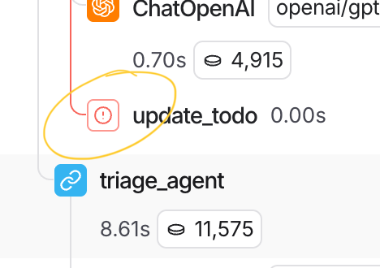
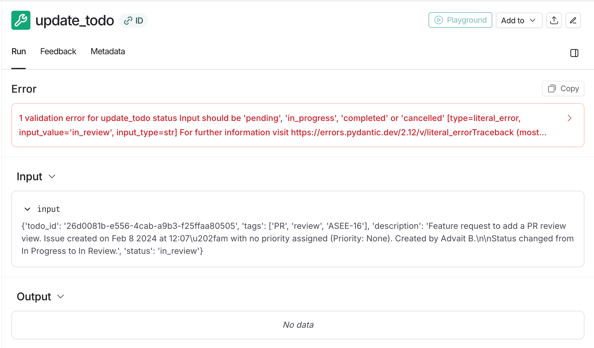
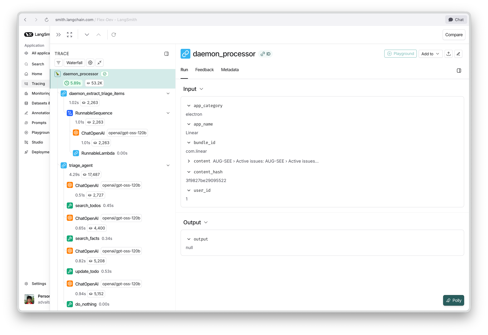
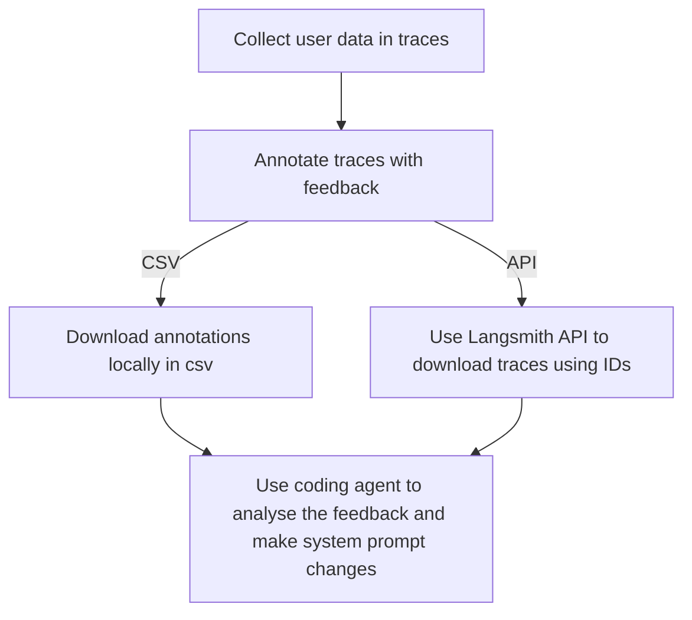

# Production Readiness Report

### Reliability

**What happens when the LLM returns malformed output? (In both the streaming pipeline and the daemon)**

When the LLM generates malformed output, we fail gracefully. This can currently be viewed in trace data. A Datadog system should ideally be attached as well, which would send alerts when these errors occur.

| Error indicator in trace tree                                | Error message in details                                    |
| ------------------------------------------------------------ | ----------------------------------------------------------- |
|  |  |

_LLM tried to set status value on todo that's not part of the enum, which led to an error. (Shown in langsmith)_

**How do you handle API failures (rate limits, timeouts, provider outages)?**

Currently none of these are being handled given the proof of concept nature of the project. Although the structure of the project allows for easy addition of these.

#### Rate limits & Timeouts

The processing of data via `freewrite_processing_agent`, `daemon_processing_agent` & `triage_agent` happens on a queue-based system, allowing us to recover from failures using a simple job retry mechanism available in any queue system. Currently the queue is handled internally with Python asyncio, although in production a queue library is recommended.

#### Provider outages

All AI interactions currently happen via OpenRouter only. This allows us to depend on them for provider outages. Given the requirement for fast processing we're limited to providers like Cerebras, SambaNova, Groq etc. OpenRouter takes an array where we can provide a list of these and OpenRouter will follow the order in case a provider is down.

Recommended reading - https://openrouter.ai/docs/guides/routing/provider-selection

**What happens if the daemon crashes mid-session? Does it recover cleanly?**

While we can have mechanisms to internally handle errors, crashes are to be taken as inevitable. Hence we should not depend on internal machinery to recover from it. Instead we depend on the OS.

MacOS allows this via `launchd` & `SMAppService`. More reading is required on this in order to get a deeper understanding.

> This isn't configured in the current application due to its proof-of-concept nature and quicker testing requirements, which involve killing the application on a regular basis.

### Observability

**Can you see what the daemon is filtering vs sending to the LLM?**

The way our current daemon pre-filtering works is hash based. In the scenario where the daemon chooses not to send data, our pipeline guarantees that it's a duplicate, which means the same data has already been sent once.

In cases where we add a classifier based pre-filter, we can add test time tracing with a logging framework.

I would highly recommend against a production logging or tracing setup at this layer due to the sheer volume of data that'd be generated & user privacy concerns.

**Can you trace why a specific action item was or wasn't extracted?**

Yes, every step through the extraction and triage pipeline is traced via Langsmith. These traces are recorded for every run and contain detailed inputs and outputs.

Annotations can also be made on every block which would then be used as feedback to the agent prompts. Here's the workflow I'm currently following:

#### Workflow

**Can you see why two items were or weren't linked across sources?**

The architecture of our pipeline extracts all information from a sources and sends high quality intent and context data to the triage agent. So linking two items across sources isn't really a thing. It's just linking.

As mentioned above, we can see details of what the triage agent searched for, and what these search results returned. Although there aren't currently any interpretability tools that allow us to understand why the LLM chose to link or not link two sources.

A certain level of analysis can be drawn by taking examples and creating multiple eval examples of it and checking what's being linked and what's not.

> Linking here means an understanding that two ingest items are related & taking action on an existing item by calling an `update` function.

**How would you debug a false positive (bad action item or bad link) in production?**

We would ideally work backward from the action to the AI trace. Here's an example scenario:

1. User reports that a speech session triggered a status change on a task when it shouldn't have.

2. We should store all actions as events in our DB linking them to the trace id from langsmith. Allowing us to quickly get the trace a particular action was generated from.

3. Once we have the trace we can understand what input triggered the pipeline, what was extracted from the input and sent to the triage agent, and finally why the triage agent chose to create that action.

> This also helps with the fact that we won't have to store all of the user sessions or raw data.

### Performance

TBD

### Privacy

**What data leaves the device? What stays local?**

#### Freewrite

All freewrite session data goes to our backend where it's stored in a Postgres table as JSONB. Whenever a new sentence is added, we use that as a trigger along with last 10000 words as context.

We can add a 24 hour erase mechanism onto this as well. All important data gets distilled down to facts that are stored in our vector database anyway.

For speech, the frontend streams mic audio over a WebSocket to our backend, which proxies it to Mistral's Voxtral realtime transcription API. Transcript deltas are relayed back to the frontend and written onto the freewrite document.

#### Daemon

For the applications that are being observed, we get accessibility tree data that's polled every second. Hashes generated by this data are stored locally and used for deduplication before sending it for processing.

**What data is stored in the vector store vs discarded after processing?**

We have two collections in the vector store. `Facts` and `Todos`.

Facts contain data that can be used later to form todos. This involves preferences, updates, or any information that's provided without an intent. 

Todos contain data on intent that the user has shown about getting something done. While creating these, facts are searched to enrich with prior context.

Other than these two pieces of information, everything else that enters the pipeline is discarded.

**Could a user audit what's been sent to the LLM?**

The current APIs don't allow for this, although we could add a source parameter on actions which would allow them to find out what had been sent.

User-based auditing is a problem because our ingest pipeline has a terrible signal-to-noise ratio. Hence, we could have the ability to audit actions which link back to their triggers.

### Edge cases

**User stops talking mid-sentence (incomplete context)**

This is alright, the transcriptions get generated as VAD triggers a close. The incomplete sentence appears on the freewrite document. This would then be sent to the freewrite processing agent, which would either discard it if there's no information or choose to act on partial information if there are at least a few sentences before the incomplete sentence.

**App crashes or becomes unresponsive while daemon is observing**

This hasn't been tested. The current single-threaded nature of our daemon means that we also get stuck while trying to retrieve the AX tree of the application.

This can be solved in two ways:

1. Add timeout on application AX tree retrievals to 3-5 secs (shouldn't take more)
2. Do the retrieval on separate threads so one application doesn't slow down the process for other applications.

**Two action items from different sources that are actually the same task but worded differently**

As long as there is a semantic similarity they'd be linked.

When information reaches the triage agent, it's treated as source agnostic. Everything happens over the fact store & the todo store.

Both these stores have semantic searching using vector similarity matching on tags that have been generated while storing.

**Vector store returns a high-confidence link that's actually wrong**

This is a failure mode and hence can't be avoided completely. Although how these get handled can be greatly improved. Starting with user feedback.

We should have an in app UX where the user can mark actions as valid / invalid (any feedback works) which would directly go inside langsmith and get attached to the trace.

This would then allow us to use this data for context engineering (improving prompt or how search works) or can be used as training data for our finetune / model training.

Recommended reading - https://docs.langchain.com/langsmith/attach-user-feedback

**Long session (3+ hours) — does anything degrade?**

Sessions can be as long as needed. The only thing that moves inside the pipeline is the trigger text and the last 10000 words from the session.

The core idea here is that flex would be continuously processing data and hence would've distilled everything important into the fact or todo store.

In a 3+ hour long session we'd only be processing data from a small window at the end. Hence, degradation wouldn't be a problem on inputs of any length.

> This does mean that our sessions are theoretically lossy in nature. Something you said 1 hour ago in a dense enough session isn't being given to the pipeline. This requires that our fact and todo triage is up to the mark that important information is always captured. This is a known tradeoff that we're actively making.

### Known Limitations

**What doesn't work yet?**

Everything technically works, with the caveat that everything can be greatly improved. My entire approach with the project was to show that given certain circumstances this is possible to do.

This also highlights how I'd like to approach applied AI here, in the sense that we get to a pipeline that technically does what we need it to in a happy flow & then spend time breaking it in multiple ways, collecting traces and improving it.

**What would you fix with another week?**

#### One week

1. Add entities like people, work (repository), team or some grouping that is grounded.

2. Create more scenarios for eval based testing.

#### Further improvements

1. Adding a grouping behaviour using “tags” (not embeddings) that allows the model to group things (very big nitpick)

2. Having the ability to steer the behaviour of the pipeline. Currently it's tuned to how we want it, although user preferences might differ. We should have some UX around feedback that changes things only for a user.

3. Add temporal nature to everything (currently sometimes jankily stored in description)

**What's the riskiest part for production deployment?**

_Controlling the user experience would be the riskiest._

The pipeline stores a lot of information as facts and todos without a strict steering mechanism. If a user was to be onboarded to both freewrite and daemon, they'd see massive amounts of todos from all data sources.

This would be overwhelming from a UX perspective & does mean that the initial reaction of the user might be to turn it off.

I currently haven't found the right UX for setting the threshold of how much of user's data gets converted to a todo.

Personally, I wouldn't want a message from my partner that goes like, "Can we go out to this restaurant on Saturday" to turn into a todo, but I could bet that there's a class of users who'd expect that.

We must have thorough discussions on how this steering would work from a UX and a data storage & user disclosure perspective.
